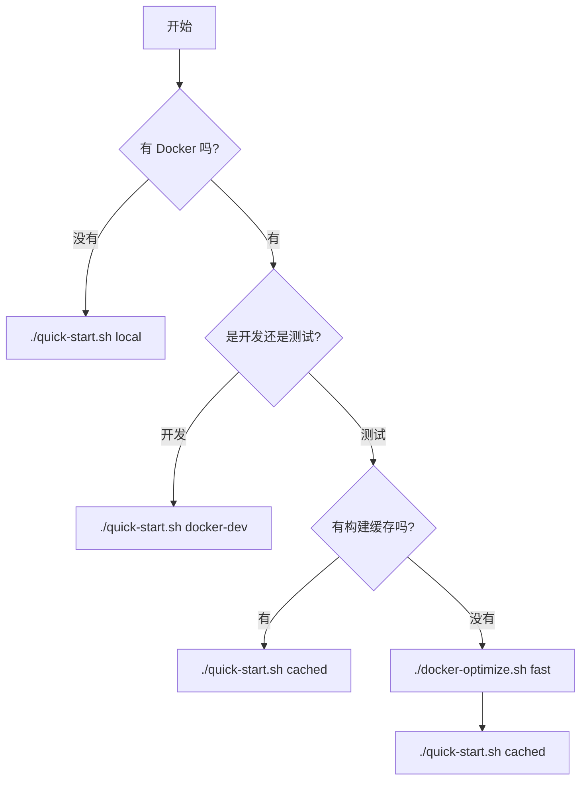

# 🚀 Dimensio Quick Start Guide

快速启动指南，提供多种启动方式以适应不同场景。

## ⚡ 快速启动（推荐）

### 1. 本地模式（最快，~5秒）
```bash
cd deploy
./quick-start.sh local
```
- ✅ 无需 Docker
- ✅ 即时启动
- ✅ 适合日常开发
- ⚠️ 需要本地 Python 3.9+ 和 Node.js 18+

### 2. Docker 开发模式（快，~30秒）
```bash
cd deploy
./quick-start.sh docker-dev
```
- ✅ 挂载源码，无需重新构建
- ✅ 代码修改即时生效
- ✅ 适合 Docker 环境开发
- ℹ️ 首次启动需要下载基础镜像

### 3. 缓存模式（很快，~10秒）
```bash
cd deploy
./quick-start.sh cached
```
- ✅ 使用已构建的镜像
- ✅ 跳过构建步骤
- ✅ 适合测试已构建的版本
- ⚠️ 需要先构建过镜像

### 4. 生产模式（慢，~5-10分钟）
```bash
cd deploy
./quick-start.sh docker
```
- ✅ 完整构建所有镜像
- ✅ 适合生产环境测试
- ⚠️ 构建时间较长

## 🔧 Docker 构建优化

如果必须使用 Docker 生产模式，可以使用优化脚本加速构建：

```bash
cd deploy
./docker-optimize.sh
```

### 优化选项

**1. 快速构建（推荐）**
```bash
./docker-optimize.sh fast
```
- 使用构建缓存
- 并行构建
- 时间：~30秒-1分钟

**2. 增量构建**
```bash
./docker-optimize.sh incremental
```
- 只重建修改的服务
- 智能检测变更
- 时间：~15-30秒

**3. BuildKit 构建**
```bash
./docker-optimize.sh buildkit
```
- Docker BuildKit 加速
- 并行层构建
- 时间：~30秒-1分钟

**4. 拉取缓存**
```bash
./docker-optimize.sh pull
```
- 从镜像仓库拉取
- 使用预构建镜像
- 时间：~20-40秒

**5. 清理重建**
```bash
./docker-optimize.sh clean
```
- 清除所有缓存
- 完全重新构建
- 时间：~5-10分钟

## 📊 启动时间对比

| 模式 | 启动时间 | 适用场景 |
|------|---------|---------|
| 本地模式 | ~5秒 | ⭐ 日常开发 |
| Docker 开发模式 | ~30秒 | Docker 开发 |
| 缓存模式 | ~10秒 | 快速测试 |
| 快速构建 | ~1分钟 | 首次 Docker 构建 |
| 增量构建 | ~30秒 | 小改动后重建 |
| 生产模式 | ~5-10分钟 | 生产测试 |

## 💡 使用建议

### 日常开发
```bash
# 推荐使用本地模式
cd deploy
./quick-start.sh local
```

### Docker 开发
```bash
cd deploy

# 首次启动（需要下载基础镜像）
./quick-start.sh docker-dev

# 后续启动（使用缓存）
./quick-start.sh cached
```

### 生产测试
```bash
cd deploy

# 优化构建
./docker-optimize.sh fast

# 启动服务
cd docker && docker-compose up -d
```

## 🛠️ 常见问题

### Q: Docker 构建太慢怎么办？
A:
1. 使用 `cd deploy && ./quick-start.sh docker-dev` 开发模式
2. 使用 `cd deploy && ./docker-optimize.sh fast` 优化构建
3. 配置 Docker 镜像加速（见主 README）

### Q: 如何切换不同的启动模式？
A:
```bash
# 停止当前服务
# 本地模式：Ctrl+C
# Docker 模式：cd docker && docker-compose down

# 启动新模式
cd deploy
./quick-start.sh [MODE]
```

### Q: 首次启动需要多久？
A:
- 本地模式：~5秒（无需安装依赖时）
- Docker 开发模式：~1-2分钟（下载基础镜像）
- Docker 生产模式：~5-10分钟（完整构建）

### Q: 如何查看服务日志？
A:
```bash
# 本地模式
tail -f ../logs/api.log
tail -f ../logs/frontend.log

# Docker 模式
cd docker && docker-compose logs -f
```

## 📝 访问地址

启动成功后访问：

- **前端**: http://localhost:3000
- **后端 API**: http://localhost:5000
- **Nginx** (生产模式): http://localhost:80

## 🎯 推荐流程



## ⚡ 终极快速启动

```bash
# 一行命令，自动选择最快模式
cd deploy && ./quick-start.sh
```

默认使用本地模式（最快）。如果需要 Docker，请指定模式参数。
